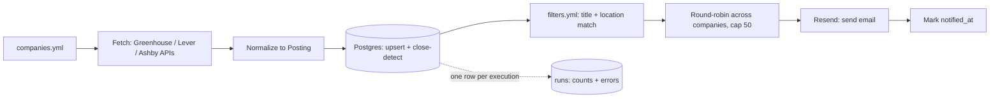
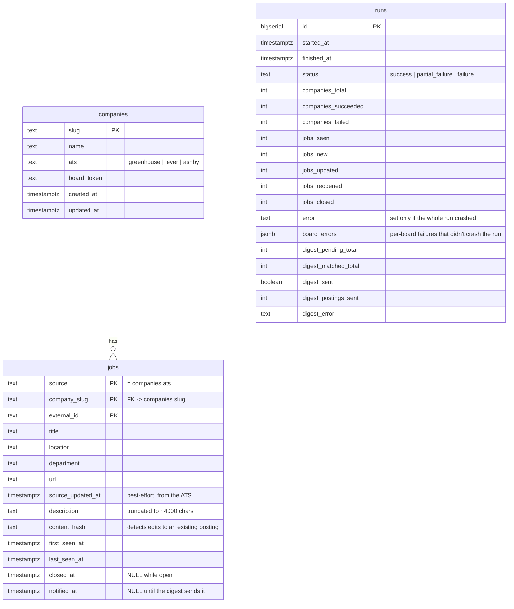

# job-ingest

[](https://github.com/zen-ash/job-posting-pipeline/actions/workflows/ingest.yml)
[](https://github.com/zen-ash/job-posting-pipeline/actions/workflows/tests.yml)

A daily ingestion pipeline for public ATS job-board postings (Greenhouse, Lever, Ashby).
It polls a hand-maintained list of companies, stores every posting revision in Postgres,
filters for roles actually worth seeing, and emails a digest of what's genuinely new.

Built as a personal job-search tool and a portfolio project — CS senior at Georgia State,
targeting entry-level data engineering / data analyst roles.

**Status:** live. Runs daily via GitHub Actions against a Neon Postgres database; the
first production run ingested 424 postings across 5 companies in 35 seconds and correctly
emailed a digest of the 2 that matched the filters.

## Build plan

- [x] 1. Repo skeleton, venv, requirements, `.gitignore`, `.env.example`
- [x] 2. ATS fetchers + normalization to a `Posting` dataclass (fixture-tested, no DB)
- [x] 3. Postgres schema + upsert logic + new/closed detection
- [x] 4. Digest email
- [x] 5. GitHub Actions daily cron
- [x] 6. This README

## How it works



One board failing (a 404, a timeout) is logged and counted, never fatal to the run — the
other companies still get fetched, and that company's existing postings are left exactly
as they were rather than being incorrectly closed. See [job_ingest/main.py](job_ingest/main.py)
and [job_ingest/db.py](job_ingest/db.py).

### The three ATS integrations

| ATS | Endpoint | Notes |
|---|---|---|
| Greenhouse | `GET boards-api.greenhouse.io/v1/boards/{token}/jobs?content=true` | `{"jobs": [...]}`, has a real `updated_at` |
| Lever | `GET api.lever.co/v0/postings/{slug}?mode=json` | bare JSON array, only a creation time (`createdAt`, epoch ms) |
| Ashby | `GET api.ashbyhq.com/posting-api/job-board/{slug}?includeCompensation=true` | `{"jobs": [...]}`, only a publish time |

All three are public and unauthenticated — no API key, no list-of-boards endpoint (you
supply the slugs), no webhooks. Freshness comes entirely from polling and diffing, which
is what the whole `first_seen_at` / `last_seen_at` / `closed_at` design in the schema below
is for. Each fetcher normalizes its source's response to one shared `Posting` dataclass
([job_ingest/models.py](job_ingest/models.py)) — see [job_ingest/ats/](job_ingest/ats/).

## Data model



Rows in `jobs` are **never deleted** — a posting's entire lifecycle lives in four
timestamps, and the posting history itself is data worth keeping (see "What's next").
`runs` has no foreign key to the other two tables on purpose: it's an audit log that
should stay readable even if a run inserted zero rows, so "no new postings today" is
always distinguishable from "the run crashed" (`error` set) or "one board failed"
(`board_errors` non-empty, `status = 'partial_failure'`).

Full DDL, with the reasoning for each non-obvious column inline as SQL comments:
[job_ingest/schema.sql](job_ingest/schema.sql).

## Filtering

The digest doesn't email every new posting — `filters.yml` (project root, not committed
logic) narrows it to roles worth seeing:

```yaml
title_include_keywords: [data analyst, analytics, business intelligence, ...]
title_exclude_keywords: [senior, staff, principal, lead, manager, ...]
location_include_keywords: [united states, usa, NY, CA, IL, ...]
```

A posting must match at least one include keyword in its title, none of the exclude
keywords, and at least one location keyword. Matching is whole-word/phrase
(`\bkeyword\b`), not plain substring — `"sql"` doesn't match inside `"MySQL"`, `"us"`
doesn't match inside `"Russia"` or `"Australia"`. This is deliberately simple keyword
matching, not the LLM-based relevance scoring planned for later (see "What's next") —
see [job_ingest/filters.py](job_ingest/filters.py).

Every run prints the full funnel (`"X new postings, Y matched filters"`) and, for
postings that passed the title filter but failed on location, a breakdown by raw
location string — the tuning signal for `location_include_keywords`, since ATS location
fields are messy multi-value strings (`"Remote, Canada; Remote, United States"`) or bare
`"City, ST"` with no country at all.

Before the 50-posting cap, matched postings are **round-robined across companies**
(alphabetical by slug, each company's own oldest-first order preserved), so one board
with a large posting count can't crowd the rest out of a capped digest.

## Digest email

Queries `jobs` where `notified_at IS NULL AND closed_at IS NULL`, sends via
[Resend](https://resend.com), then marks exactly what was sent as its own DB commit —
deliberately **after**, and separately from, the send. Resend is an HTTP call, not a
transactional resource, so send and "mark notified" can never be atomic; the choice is
between two failure modes if the process dies in between:

- **send-then-mark** (what this does): a crash after a successful send but before the
  commit means a posting can appear again in tomorrow's digest. Mildly annoying,
  self-correcting.
- mark-then-send: a crash after marking but before sending means a posting is
  permanently marked notified with no email ever having gone out — silently lost
  forever, which is the one failure this whole pipeline exists to avoid.

At-least-once beats at-most-once here. See the docstring in
[job_ingest/digest.py](job_ingest/digest.py) for the full reasoning.

## Running it

### Prerequisites

- **Python 3.12** — `brew install python@3.12` (this repo pins to 3.12 explicitly;
  Homebrew also ships a 3.9 you should *not* use for this project).
- **Docker Desktop** — runs a local Postgres for development via `docker-compose.yml`.
- **A free [Neon](https://neon.tech) Postgres project** — what GitHub Actions writes to
  on its daily run, since Actions runners can't reach a Postgres running on your Mac.
- **A free [Resend](https://resend.com) account** — sends the digest email.

### Local setup

```bash
python3.12 -m venv .venv
source .venv/bin/activate
pip install -r requirements-dev.txt

cp .env.example .env             # fill in real values — .env is gitignored, never commit it
docker compose up -d             # local Postgres 17 on port 5433
```

### Running the pipeline

```bash
# Fetch + print one company, no DB — useful when adding a new company.yml entry
python -m job_ingest.main --company gitlab

# Full run: every company in companies.yml, upserted into Postgres, digest sent
python -m job_ingest.main

# Same, but skip the digest send (e.g. while iterating locally)
python -m job_ingest.main --skip-digest
```

### Tests

```bash
ruff check .      # lint
pytest -v         # 51 tests, all offline — fixture JSON + pure functions, no network/DB
```

### Config files you edit by hand

- **`companies.yml`** — target company list (`slug`, `name`, `ats`, `board_token`).
  Seeded with 5 real, verified-working boards spanning all three ATSs.
- **`filters.yml`** — the keyword lists above.

## GitHub Actions (daily cron)

`.github/workflows/ingest.yml` runs the full pipeline once a day and can also be
triggered by hand from the Actions tab (`workflow_dispatch`) — useful for testing a
change without waiting for the next scheduled run.

### Why GitHub Actions instead of a local cron job

A `cron` entry (or `launchd` job) on this Mac would only run while the laptop is on,
awake, and not asleep from the lid being closed — exactly the conditions a daily
morning digest can't rely on. GitHub Actions runs on GitHub's infrastructure regardless
of whether this machine is even turned on, at effectively no cost for a job this small
and infrequent, and it's what the Neon-vs-local-Postgres split is already built around:
the workflow talks to Neon (reachable from anywhere), while local Docker Postgres stays
purely a dev convenience.

### Schedule and DST

The workflow runs at `11:00 UTC` daily. GitHub Actions cron schedules are always UTC
and have no concept of time zones or daylight saving — so this is a fixed point that
drifts relative to Atlanta time across the year:

| | UTC | Atlanta (America/New_York) |
|---|---|---|
| Winter (EST, UTC-5) | 11:00 | 6:00 AM |
| Summer (EDT, UTC-4) | 11:00 | 7:00 AM |

That one-hour, twice-a-year drift is an accepted tradeoff rather than something the
workflow corrects — the digest still lands before the workday either way, which is all
that actually matters here.

### Repo secrets

Under **Settings → Secrets and variables → Actions**:

- `DATABASE_URL` — the **Neon** connection string (not the local Docker one — Actions
  runners can't reach `localhost`)
- `RESEND_API_KEY`
- `DIGEST_FROM_EMAIL`
- `DIGEST_TO_EMAIL`

`.github/workflows/tests.yml` runs lint (`ruff`) and the full offline test suite on
every push and pull request — no secrets needed, since all 51 tests run against
fixtures and pure functions rather than the network or a live database.

## What's next

Explicitly out of scope for this build (see the original spec): any LLM scoring of
postings, any web UI, any browser automation. With real posting history accumulating
daily, the natural next steps:

- **LLM-based relevance/fit scoring** — the reason `jobs` never deletes rows and tracks
  `content_hash`: score each posting once against a resume/preferences, re-score only
  when `content_hash` changes, and use that to sort or further filter the digest instead
  of (or alongside) the keyword lists.
- **A lightweight read-only dashboard** over the accumulated posting history — trend of
  postings per company over time, average time-to-close, which companies post-and-pull
  fastest.
- **Slack or SMS digest delivery** as an alternative/addition to email.
- **Company-list growth**: past 5 boards, actually populate `companies.yml` with target
  companies — 200+ was the scale this pipeline's cap/round-robin/pagination-safety
  choices were already made for, not the 5 it ships with.
- **Location filtering v2**: geocode or normalize `location` at ingest time instead of
  keyword-matching messy ATS strings at digest time, once there's a concrete case the
  keyword approach can't handle well.
- **Alerting on repeated board failures** — `runs.board_errors` already has the data;
  a company whose board has failed N runs in a row is worth a separate notification,
  not just a line in that day's digest run log.
