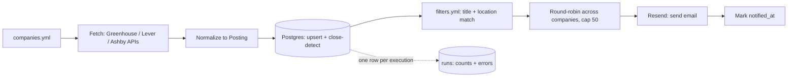
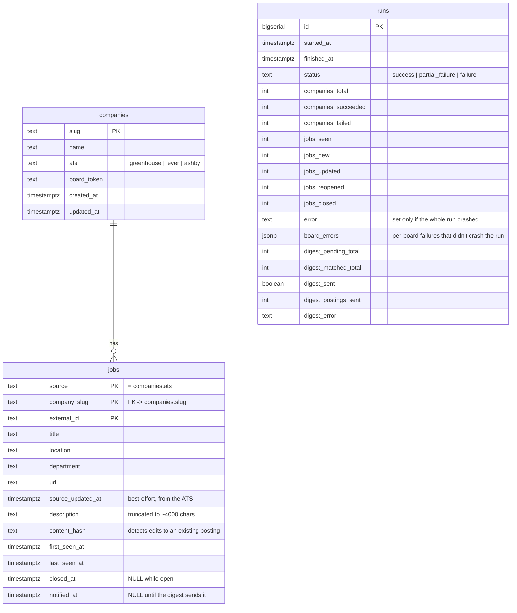

# job-posting-pipeline

[](https://github.com/zen-ash/job-posting-pipeline/actions/workflows/ingest.yml)
[](https://github.com/zen-ash/job-posting-pipeline/actions/workflows/tests.yml)

A daily ingestion pipeline for public ATS job-board postings (Greenhouse, Lever, Ashby).
It polls a hand-maintained list of companies, stores every posting revision in Postgres,
filters for roles actually worth seeing, and emails a digest of what's genuinely new.

Built as a personal job-search tool and a portfolio project.

**Status:** live. Runs daily via GitHub Actions against a Neon Postgres database,
polling 17 companies (fintech/payments and healthcare payers) across all three ATSs and
seeing roughly 2,500 open postings in about 6m40s per run. The most recent run narrowed
those to 61 matching the filters, of which the first 50 go out in the digest.

## How it works



One board failing (a 404, a timeout) is logged and counted, never fatal to the run — the
other companies still get fetched, and that company's existing postings are left exactly
as they were rather than being incorrectly closed. See [job_ingest/main.py](job_ingest/main.py)
and [job_ingest/db.py](job_ingest/db.py).

### The three ATS integrations

| ATS | Endpoint | Notes |
|---|---|---|
| Greenhouse | `GET boards-api.greenhouse.io/v1/boards/{token}/jobs?content=true` | `{"jobs": [...]}`, has a real `updated_at` |
| Lever | `GET api.lever.co/v0/postings/{slug}?mode=json` | bare JSON array, only a creation time (`createdAt`, epoch ms) |
| Ashby | `GET api.ashbyhq.com/posting-api/job-board/{slug}?includeCompensation=true` | `{"jobs": [...]}`, only a publish time |

All three are public and unauthenticated — no API key, no list-of-boards endpoint (you
supply the slugs), no webhooks. Freshness comes entirely from polling and diffing, which
is what the whole `first_seen_at` / `last_seen_at` / `closed_at` design in the schema below
is for. Each fetcher normalizes its source's response to one shared `Posting` dataclass
([job_ingest/models.py](job_ingest/models.py)) — see [job_ingest/ats/](job_ingest/ats/).

## Data model



Rows in `jobs` are **never deleted** — a posting's entire lifecycle lives in four
timestamps, and the posting history itself is data worth keeping (see "What's next").
`runs` has no foreign key to the other two tables on purpose: it's an audit log that
should stay readable even if a run inserted zero rows, so "no new postings today" is
always distinguishable from "the run crashed" (`error` set) or "one board failed"
(`board_errors` non-empty, `status = 'partial_failure'`).

Full DDL, with the reasoning for each non-obvious column inline as SQL comments:
[job_ingest/schema.sql](job_ingest/schema.sql).

## Filtering

The digest doesn't email every new posting — `filters.yml`, a plain config file at the
project root (not something baked into the code), narrows it to roles worth seeing:

```yaml
title_include_keywords:       [analyst, analytics, data engineer, audit, compliance, risk, ...]
title_exclude_keywords:       [senior, sr, staff, manager, director, software engineer, ...]
location_include_keywords:    [united states, usa, us, north america, georgia, texas, ...]
location_include_state_codes: [AL, AK, AZ, ..., DC]
```

A posting must match at least one `title_include_keywords` entry, none of
`title_exclude_keywords`, and at least one entry from *either* location list. Exclude
beats include: a title matching both is excluded.

### How matching works

Case-insensitive, period-stripped, and whole-word/phrase:

- **Whole-word, not substring** — `"sql"` doesn't match inside `"MySQL"`, and `"us"`
  doesn't match inside `"Russia"` or `"Australia"`.
- **Period-stripped on both sides**, so `"U.S."` matches the `us` entry and `"Sr."`
  matches `sr`, with no separate punctuated entry needed for either.
- Implemented as `(?<!\w)keyword(?!\w)`, not `\bkeyword\b`. `\b` requires a
  word/non-word transition, which a keyword *ending* in punctuation doesn't have when
  the next character is also non-word — so such entries silently never match at all.

`location_include_state_codes` is the deliberate exception: matched **case-sensitively
and only immediately after a comma** (`", GA"`). A permissive whole-word match on bare
two-letter codes collides with ordinary English words a location string plausibly
contains — `in`, `or`, `hi`, `me`, `de`. Spelled-out state names live in
`location_include_keywords` and recover the recall that strictness gives up, catching
`"Austin, Texas"` where the code form wouldn't appear.

This is deliberately simple keyword matching, not the LLM-based relevance scoring
planned for later (see "What's next") — see [job_ingest/filters.py](job_ingest/filters.py).

### Tuning reports

A filter is only as good as your ability to see what it threw away, so every run prints
the funnel plus **two symmetric false-negative reports**, one per half of the filter:

```
preview (--skip-digest): 2718 new postings, 61 matched filters, 50 would be included
  excluded by title (matched an include keyword, tune filters.yml):
     67x  "senior"
     32x  "staff"
      6x  "software engineer"
  excluded by location (passed title filter, tune filters.yml):
      6x  Singapore
      5x  Mexico City
```

- **By title** — postings that matched an include keyword but were then killed by an
  exclude, grouped by *which exclude keyword fired*. Without this, excludes are
  invisible: an over-broad one silently removes postings you never learn existed. This
  report is what surfaced `staff` removing 11 wanted postings in one digest.
- **By location** — postings that passed the title filter but failed on location,
  grouped by raw location string, since ATS location fields are messy multi-value
  strings (`"Remote, Canada; Remote, United States"`) or bare `"City, ST"` with no
  country marker at all.

A title matching no include keyword appears in neither report — there's nothing to tune
from "didn't match anything." Run `python -m job_ingest.main --skip-digest` to see both
reports without sending an email.

Before the 50-posting cap, matched postings are **round-robined across companies**
(alphabetical by slug, each company's own oldest-first order preserved), so one board
with a large posting count can't crowd the rest out of a capped digest.

## Digest email

Queries `jobs` where `notified_at IS NULL AND closed_at IS NULL`, sends via
[Resend](https://resend.com), then marks exactly what was sent as its own DB commit —
deliberately **after**, and separately from, the send. Resend is an HTTP call, not a
transactional resource, so send and "mark notified" can never be atomic; the choice is
between two failure modes if the process dies in between:

- **send-then-mark** (what this does): a crash after a successful send but before the
  commit means a posting can appear again in tomorrow's digest. Mildly annoying,
  self-correcting.
- mark-then-send: a crash after marking but before sending means a posting is
  permanently marked notified with no email ever having gone out — silently lost
  forever, which is the one failure this whole pipeline exists to avoid.

At-least-once beats at-most-once here. See the docstring in
[job_ingest/digest.py](job_ingest/digest.py) for the full reasoning.

## Running it

### Prerequisites

- **Python 3.12** — `brew install python@3.12` (this repo pins to 3.12 explicitly;
  Homebrew also ships a 3.9 you should *not* use for this project).
- **Docker Desktop** — runs a local Postgres for development via `docker-compose.yml`.
- **A free [Neon](https://neon.tech) Postgres project** — what GitHub Actions writes to
  on its daily run, since Actions runners can't reach a Postgres running on your Mac.
- **A free [Resend](https://resend.com) account** — sends the digest email.

### Local setup

```bash
python3.12 -m venv .venv
source .venv/bin/activate
pip install -r requirements-dev.txt

cp .env.example .env             # fill in real values — .env is gitignored, never commit it
docker compose up -d             # local Postgres 17 on port 5433
```

### Running the pipeline

```bash
# Fetch + print one company, no DB — useful when adding a new company.yml entry
python -m job_ingest.main --company gitlab

# Full run: every company in companies.yml, upserted into Postgres, digest sent
python -m job_ingest.main

# Same, but skip the digest send (e.g. while iterating locally)
python -m job_ingest.main --skip-digest
```

### Tests

```bash
ruff check .      # lint
pytest -v         # 97 tests, all offline — fixture JSON + pure functions, no network/DB
```

### Config files you edit by hand

- **`companies.yml`** — target company list (`slug`, `name`, `ats`, `board_token`).
  17 companies (fintech/payments and healthcare payers) spanning all three ATSs, each
  verified against its live endpoint before being added.
- **`filters.yml`** — the keyword lists above.

## GitHub Actions (daily cron)

`.github/workflows/ingest.yml` runs the full pipeline once a day and can also be
triggered by hand from the Actions tab (`workflow_dispatch`) — useful for testing a
change without waiting for the next scheduled run.

### Why GitHub Actions instead of a local cron job

A `cron` entry (or `launchd` job) on this Mac would only run while the laptop is on,
awake, and not asleep from the lid being closed — exactly the conditions a daily
morning digest can't rely on. GitHub Actions runs on GitHub's infrastructure regardless
of whether this machine is even turned on, at effectively no cost for a job this small
and infrequent, and it's what the Neon-vs-local-Postgres split is already built around:
the workflow talks to Neon (reachable from anywhere), while local Docker Postgres stays
purely a dev convenience.

### Schedule and DST

The workflow runs at `11:23 UTC` daily. GitHub Actions cron schedules are always UTC
and have no concept of time zones or daylight saving — so this is a fixed point that
drifts relative to Atlanta time across the year:

| | UTC | Atlanta (America/New_York) |
|---|---|---|
| Winter (EST, UTC-5) | 11:23 | 6:23 AM |
| Summer (EDT, UTC-4) | 11:23 | 7:23 AM |

That one-hour, twice-a-year drift is an accepted tradeoff rather than something the
workflow corrects — the digest still lands before the workday either way, which is all
that actually matters here.

### Schedule reliability

**Scheduled runs are best-effort, not guaranteed — expect some days to be skipped
entirely.** GitHub queues `schedule` events on shared infrastructure and drops them
under load; on free runners this is a documented, normal outcome, not a bug in this
pipeline. Late runs (tens of minutes) and occasional missing days are both expected.

The `:23` in the cron expression is a mitigation, not a fix. Top-of-the-hour slots
(`0 * * * *`) are by far the most contended, since that's what most people write —
this workflow originally ran at `11:00 UTC`, fired 20 minutes late one day, and was
skipped outright the next. An off-peak minute competes with fewer queued jobs. It
lowers the odds of a skip; it doesn't eliminate them.

Two things make a skipped day cheap here, by design:

- **Nothing is lost.** New/changed postings are detected by diffing against the
  database, not by "what appeared in the last 24 hours" — so a run that happens after
  a two-day gap reports everything from both days. Likewise the digest sends on
  `notified_at IS NULL`, not a time window, so a posting missed by a skipped run is
  still pending for the next one.
- **Skips are visible after the fact.** Every execution writes a row to `runs`, so a
  missing day is a missing row — distinguishable from a run that happened and found
  nothing (`status = 'success'` with `jobs_new = 0`) or one that failed
  (`status = 'failure'`, `error` set).

If a day genuinely matters, trigger it by hand: **Actions → Daily job ingest → Run
workflow**.

### Repo secrets

Under **Settings → Secrets and variables → Actions**:

- `DATABASE_URL` — the **Neon** connection string (not the local Docker one — Actions
  runners can't reach `localhost`)
- `RESEND_API_KEY`
- `DIGEST_FROM_EMAIL`
- `DIGEST_TO_EMAIL`

`.github/workflows/tests.yml` runs lint (`ruff`) and the full offline test suite on
every push and pull request — no secrets needed, since all 97 tests run against
fixtures and pure functions rather than the network or a live database.

## What's next

Explicitly out of scope for this build (see the original spec): any LLM scoring of
postings, any web UI, any browser automation. With real posting history accumulating
daily, the natural next steps:

- **LLM-based relevance/fit scoring** — the reason `jobs` never deletes rows and tracks
  `content_hash`: score each posting once against a resume/preferences, re-score only
  when `content_hash` changes, and use that to sort or further filter the digest instead
  of (or alongside) the keyword lists.
- **A lightweight read-only dashboard** over the accumulated posting history — trend of
  postings per company over time, average time-to-close, which companies post-and-pull
  fastest.
- **Slack or SMS digest delivery** as an alternative/addition to email.
- **Company-list growth**: past 5 boards, actually populate `companies.yml` with target
  companies — 200+ was the scale this pipeline's cap/round-robin/pagination-safety
  choices were already made for, not the 5 it ships with.
- **Location filtering v2**: geocode or normalize `location` at ingest time instead of
  keyword-matching messy ATS strings at digest time, once there's a concrete case the
  keyword approach can't handle well.
- **Alerting on repeated board failures** — `runs.board_errors` already has the data;
  a company whose board has failed N runs in a row is worth a separate notification,
  not just a line in that day's digest run log.
